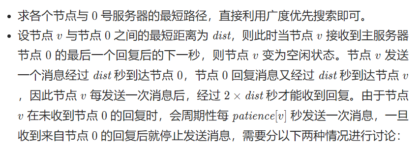
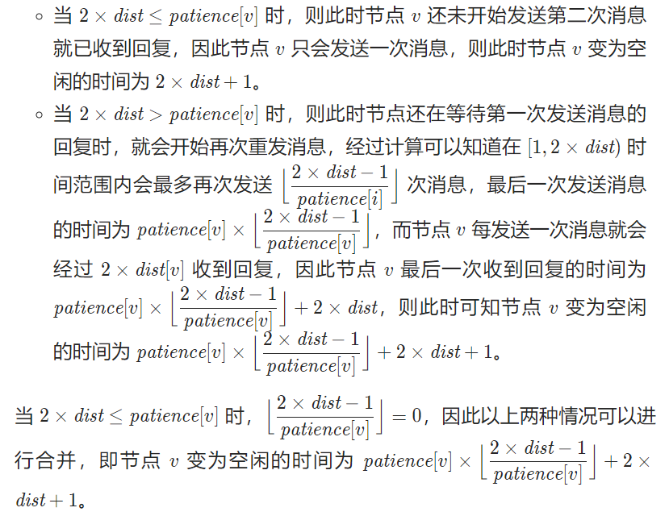

```java
class Solution {
    public int networkBecomesIdle(int[][] edges, int[] patience) {
        int n = patience.length;       
        List<Integer>[] adj = new List[n];
        for (int i = 0; i < n; ++i) {
            adj[i] = new ArrayList<Integer>();
        }
        boolean[] visit = new boolean[n];
        for (int[] v : edges) {
            adj[v[0]].add(v[1]);
            adj[v[1]].add(v[0]);
        }

        Queue<Integer> queue = new ArrayDeque<Integer>();
        queue.offer(0);
        visit[0] = true;
        int dist = 1;
        int ans = 0;
        while (!queue.isEmpty()) {
            int size = queue.size();
            for (int i = 0; i < size; i++) {
                int curr = queue.poll();
                for (int v : adj[curr]) {
                    if (visit[v]) {
                        continue;
                    }
                    queue.offer(v);
                    
                    //重要
                    int time = patience[v] * ((2 * dist - 1) / patience[v]) + 2 * dist + 1;
                    
                    ans = Math.max(ans, time);
                    visit[v] = true;
                }
            }
            dist++;
        }
        return ans;
    }
}
```
