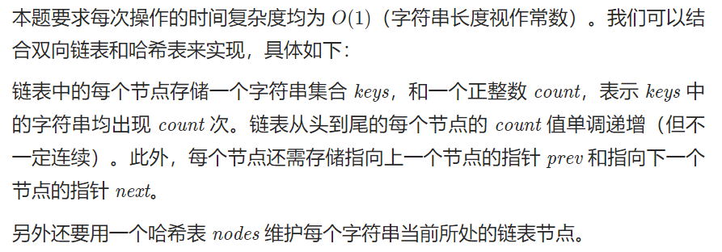

## 先来瞅瞅我的做法

```java
class AllOne {
    public Map<String,Integer> m;

    public AllOne() {
        m = new HashMap<String,Integer>();
    }
    
    public void inc(String key) {
        if(m.containsKey(key)){
            m.put(key,m.get(key)+1);
        }else{
            m.put(key,1);
        }
    }
    
    public void dec(String key) {
        m.put(key,m.get(key)-1);
        if(m.get(key)==0){
            m.remove(key);
        }
    }
    
    public String getMaxKey() {
        String ans="";
        int max=0;
        for(String key:m.keySet()){
            if(max<m.get(key)){
                ans=key;
                max=m.get(key);
            }
        }
        return ans;
    }
    
    public String getMinKey() {
        String ans="";
        int min=Integer.MAX_VALUE;
        for(String key:m.keySet()){
            if(min>m.get(key)){
                ans=key;
                min=m.get(key);
            }
        }
        return ans;
    }
}
```

- ### 不用猜也知道吧，又超时哩。这么做怎么可能O(1)嘛。
- ### 所以怎么办捏？题解说是要用双向链表。我晕。




```java
class AllOne {
    Node root;
    Map<String, Node> nodes;

    public AllOne() {
        root = new Node();
        root.prev = root;
        root.next = root;  // 初始化链表哨兵，下面判断节点的 next 若为 root，则表示 next 为空（prev 同理）
        nodes = new HashMap<String, Node>();
    }
    
    public void inc(String key) {
        if (nodes.containsKey(key)) {
            Node cur = nodes.get(key);
            Node nxt = cur.next;
            if (nxt == root || nxt.count > cur.count + 1) {
                nodes.put(key, cur.insert(new Node(key, cur.count + 1)));
            } else {
                nxt.keys.add(key);
                nodes.put(key, nxt);
            }
            cur.keys.remove(key);
            if (cur.keys.isEmpty()) {
                cur.remove();
            }
        } else {  // key 不在链表中
            if (root.next == root || root.next.count > 1) {
                nodes.put(key, root.insert(new Node(key, 1)));
            } else {
                root.next.keys.add(key);
                nodes.put(key, root.next);
            }
        }
    }
    
    public void dec(String key) {
        Node cur = nodes.get(key);
        if (cur.count == 1) {  // key 仅出现一次，将其移出 nodes
            nodes.remove(key);
        } else {
            Node pre = cur.prev;
            if (pre == root || pre.count < cur.count - 1) {
                nodes.put(key, cur.prev.insert(new Node(key, cur.count - 1)));
            } else {
                pre.keys.add(key);
                nodes.put(key, pre);
            }
        }
        cur.keys.remove(key);
        if (cur.keys.isEmpty()) {
            cur.remove();
        }
    }
    
    public String getMaxKey() {
        return root.prev != null ? root.prev.keys.iterator().next() : "";
    }
    
    public String getMinKey() {
        return root.next != null ? root.next.keys.iterator().next() : "";
    }
}

class Node {
    Node prev;
    Node next;
    Set<String> keys;
    int count;

    public Node() {
        this("", 0);
    }

    public Node(String key, int count) {
        this.count = count;
        keys = new HashSet<String>();
        keys.add(key);
    }

    public Node insert(Node node) {  // 在 this 后插入 node
        node.prev = this;
        node.next = this.next;
        node.prev.next = node;
        node.next.prev = node;
        return node;
    }

    public void remove() {
        this.prev.next = this.next;
        this.next.prev = this.prev;
    }
}
```

- ### 这题好像还跟 ***146.LRU*** 和 ***460.LFU*** 有点关系。
- ### 等以后做到了，好好复习一下。
